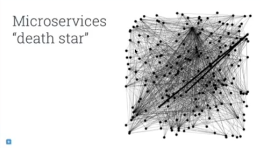
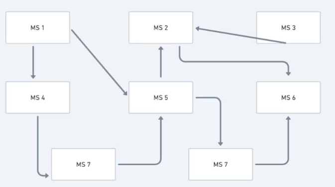
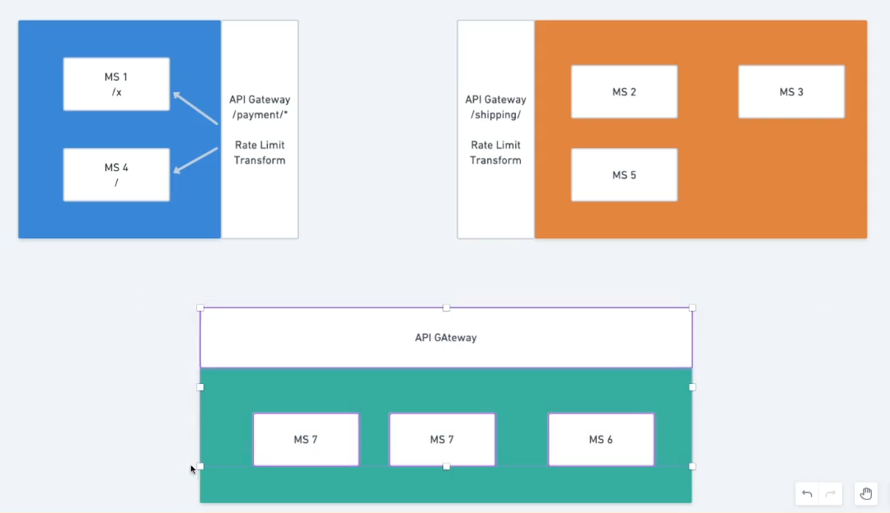

# Coreografia vs orquestração

## Coreografia
Uma característica da arquitetura em microsserviços é que a comunicação entre ele fica caótica.
Cada serviço, chama outros, que chamam outros e por aí vai.
Essas sequências de chamadas vão surgindo de maneira organica, sem ter um "maestro", por isso chamamos isso de coreografia.

Dessa comunicação caótica, surge o termo "estrela da morte" (death star), com exemplos famosos da netflix e amazon. ;E uma grafo representando as chamadas e serviços existentes na arquitetura, e a imagem mostra o quão complexa se torna a comunicação entre esses serviços.

## Orquestração
A coreografia nem sempre garante que os serviços irão se comunicar corretamente.
Uma maneira de melhorar isso, é com a orquestração.

Ela é implementada com a inserção de um "maestro" que vai coordenar que cada componente entre em cena na hora certa.

Exemplo de cenário problemático: microsserviços de um ecommerce.

No exemplo acima, o fluxo vai ter acontecido com sucesso caso toda sequência de microsserviços tenha acontecido corretamente.

Porém, imagine que por exemplo, o microsserviço do centro de distribuição (CD) caiu. O que acontece? Talvez seja necessário tomar algumas decisões. Por exemplo, chamar um cancelamento no serviço de "payments", ou um outro de "notifications" pra avisar o usuário etc.

Por isso é necessário maneiras de um mastro, mediador, pra orquestrar esses fluxos.

### Exemplo de orquestramento em caso de falha no fluxo

Seguindo o exemplo do ecommerce, a ordem de chamadas ideal seria:
 - Checkout -> Payment -> Stock -> CD -> Invoice -> Shipping

Exemplo de uma compra:
    - Checkout = OK
    - Payment = OK
    - Stock = OK
    - CD = FAIL!

Nesse caso, o orquestrador teria um plano de fallback pra seguir, que seria ir "desfazendo" a operação em cada microsserviço em uma sequencia inversa a que foi feita para a compra.
Ex:
 - undo CD -> undo Stock -> undo Payment -> undo Checkout

Fluxo "desfazer compra"
    - undo CD = OK
    - undo Stock = OK
    - undo Payment = OK
    - undo Checkout = OK
    - Compra desfeita.

### Responsabilidade do desenvolvedor
Esses fluxo precisam ser definidos em conjunto com negócio, muitas vezes usando recursos para documentação como BPMN. Saber a ordem correta dos fluxos acaba saindo um pouco da área da tecnologia, pois é necessário entender como o fluxo funciona como um todo, entrando nos detalhes de cada área do negócio.

## Estratégias pra mitigar "estrela da morte"

Podemos agrupar os microsserviços que estão no mesmo contexto atrás de API gateways. Assim, um microsserviço não chama outros serviços, de contextos diferentes, de maneira direta, mas sim chamam o API Gateway, simplificando um pouco pois os microsserviços não precisam saber exatamente qual microsserviço chamar, mas sim só o contexto.

Dentro do mesmo contexto, ou seja, dentro do mesmo API Gateway, o microsserviço pode chamar um microsserviço diretamente, e organizamos isso via urls.

O API Gateway poderia por exemplo, ter a url `{contexto}/`, e o microsserviço algo como `{contexto}/xyz` por exemplo.

Isso simplifica pois com a separação por contexto, podemos ter uma visão mais "alto nível" do sistema todo.

Antes do agrupamento

Depois do agrupamento
