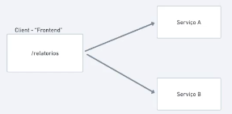
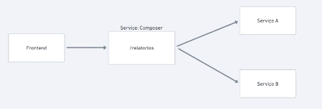
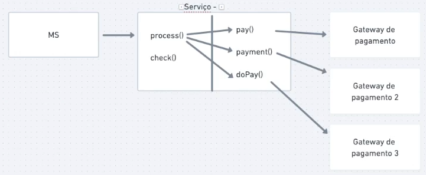

# Patterns
Ao trabalhar com microsserviços temos problemas que não existem nos sistemas monolíticos. Para lidar com esses problemas, existem diversos padrões.

## Api Composition
Exemplo de problema:
 - contexto: Geração de relátorios
 - Um frontend, Serviço A e serviço B
 - Pra gerar o relatório
    - frontend chama serviço A
    - chama o serviço B
    - junta os dados e gera o relatório

Nesse exemplo, nosso problema tá resolvido.

Mas e se em vez de um frontend, temos um outro service como client que chama os outros serviços, junta os dados e gera o relatório?

Nos dois casos acima, temos exemplos de API Composition (composer), pois temos um componente (o frontend ou o serviço no segundo exemplo) que são responsáveis por chamar os outros serviços, juntar os dados e gerar o relatório.

De maneira mais elaborada, esse padrão é quando nós fazemos com que os clientes do serviços sejam responsáveis por chamar os serviços na ordem correta e combinar os dados gerados por eles. É o padrão mais simples que temos e um dos mais importantes.

### Vantagens
Fica centralizado em um único lugar a responsabilidade de buscar e combinar os dados, e os serviços não precisam lidar com isso, não criando acoplamento entre eles.

### Desvantagens
 - Problema de disponibilidade: Se um dos serviços cair, o composer basicamente cai também.
 - Consistência nos dados: pode ser que ao terminar de chamar todos os serviços, os dados gerador pelos primeiros serviços já estejam desatualizados.
 - Aumento de complexidade pois adicionamos um componente somente pra compor esses dados.
 - Temos um serviço criado com o objeto só de chamar outros serviços.
 - Alta latência pois por baixo dos panos vários serviços estão sendo chamados.

### Resiliência
Como o composer vai fazer operações ou gerar dados a partir de outros services, é precisa pensar no que fazer caso algum deles falhe ou esteja indisponível.
Num relatório, por exemplo, temos a opção de colocar as informações referentes a um serviço que falou de maneira reduzida.

## Decompose by business capability
Esse é um padrão que vai ajudar a iniciar migração de um monolito para uma distrubuir em microsserviços.

### Exemplo prático
Um sistema monolítico com áreas de:
 - Financeiro
 - CRM
 - Compras
 - Clientes

Um monolito desse tipo, poderíamos inicialmente gerar um serviço para cada uma dessas áreas.
O grande dificultadr, é que normalmente, a relação entre áreas do monilitos e microsserviços não serão 1 : 1.

Por exemplo, o módulo financeiro pode ter ligações com a área de clientes e CRM, gerando áreas cinzentas. Esses casos que vão gerar mais dificuldade na separação.

Uma maneira de diminuir essas áreas cinzentas é usando o DDD.

### DDD
Com ele, vamos conseguir elencar o que faz parte do **core**  e os **subdomínios** do sistema, assim deixando mais claro como dividir os microsserviços.

### Resumo
Um dos principais pontos é entender que, embora o monolito já esteja separado em contextos, módulos etc, essas separações dificilmente vão funcionar como microsserviços. Existem intersecções entre esses módulos que precisam ser entendidas pra conseguir fazer a decomposição.

## Strangler application
Esse é um padrao que pode ser usado na transição de monolito para microsserviços.

Com ele, vamos definir algumas regras para novas features no sistema.

1 - Toda nova feature será feita como microsserviço
2 - Pegar pequenos pedaços do sistema monolítico e transformar em microsserviço.

Dessa forma, vamos diminuindo o monolito aos poucos, e com o passar do tempo, o monolito não estará mais fazendo nada, por isso o nome "strangler", é como se estivéssemos estrangulando o monolito aos poucos até que ele morra.

### Pontos de atenção
#### Comunicação
Um dos primeiros problemas que irá surgir é a comunicação com o monolito. Pra isso provavelmente será necessário colocar novas ferramentas, como para eventos por exemplo, que ainda não são usadas, aumento o atrito para começar essa migração.

#### Maturidade da equipe
É necessário que a equipe já esteja preparada para coisas como automação, cobertura de testes etc. Sem essas coisas é inviável trabalhar com microsserviços, e então, relembrando coisas anotadas anteriormente, se a equipe não possui essa maturidade, trabalhar com microsserviços não é uma opção.

#### Banco de dados
A ideia é que cada microsserviço tenha seu próprio banco de dados. Mas para esse momento de transição, é comum que se use um banco compartilhado para esses serviços e isso vai sendo migrado para o banco específico do serviço.

Para auxiliar nessa migração, o que se pode fazer é migrar para o novo banco do serviço somente os dados que ele realmente usa.

O uso de APM também pode ajudar com as métricas que mostram o uso do banco, quais tabelas sao mais lidas, quais tem mais escrita etc. Isso pode dar insights de como fazer a migração.

#### APM
O correto é que cada serviço tenha seu próprio APM. Isso é obrigatório pra conseguir acomapanhar a saúde do serviço.

#### Métricas
É interessante definir métricas esperadas para os novos serviços e configurar alarmes, para garantir que anormalidades serão mitigadas o quanto antes.

## ACL (anti corruption layer)
É um padrão onde criamos um serviço para traduzir inputs e outputs de um serviço para outro, a fim de que o input/output de um serviço B não polua o serviço A.

### Migração monolito pra microsserviços
Isso é útil por exemplo na fase de migração de monolito para microsserviços. Durante a migração, nosso microsserviço pode passar a usar novos campos, nomes, estruturas de dados que não compatíveis com a forma com que a mesma feature usava no monolito.

E como durante essa fase de transição, é comum que o monolito se comunique com o microsserviço (ou vice versa), o código antigo do monolito pode acabar poluindo o microsserviço com coisas como:

 - O monolito pede um campo novo para processar um pagamento, mas é um campo obsoleto e por isso o microsserviço não o considera. Mas o campo é obrigatório.

Nesse exemplo, o ACL pode intermediar o microsserviço e o monolito para absorver esses detalhes, não poluindo o microsserviço com esses detalhes que, para o contexto do microsserviço são inúteis.

### Ser agnósticos a parceiros
Isso também pode ser usado quando queremos que detalhes das APIs de parceiras interfiram em em como vamos construir nossos serviços. Isso é útil para que nosso código não siga o contexto do parceiro, e também para ser agnóstico a eles, assim podendo ter vários parceiros e trocar entre eles de maneira transparente.

Por exemplo, no caso de parceiros de gateway de pagamentos ou baas.

Podemos achar interessante, que nosos microsserviço de pagamento possa alternar entre parceiros de gateway, e pra isso vamos implementar um pra cada bandeira de cartão, e deve ser usado aquele com a menor taxa para o cartão que o usuário vai usar.

Uma forma de fazer isso, é inserindo a lógica de cada um desses gateways no nosso microsserviço, mas isso vai acabar "corrompendo", "poluindo" ele.

O microsserviço estaria acoplado a cada um desses gateways, e portanto sendo afetado quando a interface pública desses mudarem.

Para evitar isso, criamos um ACL pra intermediar nosso microsserviço e os gateways.

Assim, o nosso microsserviço chama o ACL, que vai ter uma interface pública uniforme. Para o microsserviço, o ACL é o próprio gateway. Por baixo dos panos ele está funcionando como uma espécie de proxy.

Esse ACL, internamente, vai receber o pedido de pagamento e direcionar pro gateway correto seguindo as regras necessárias e também cuidando do input/output compatível com cada um deles.

## API Gateway
É um ponto único de entrada para um conjunto de microsserviços. Ele é útil pois abstrai os servidores para os clientes, sendo assim, um tipo de "proxy reverso".

### Providers
Temos o Kong que é bastante popular e pode ser usado em conjunto com kubernetes.
Todos os cloud providers (aws, gcp etc) também fornecem essa ferramenta.

### Utilidades

#### Facilitação de acesso aos servidores
Como os microsserviços estão em uma rede, cada um tem IP e DNS. E esses também podem estar espalhados em máquinas e pods diferentes.

Ou seja, o acesso aos microsserviços não é trivial. Para facilitar isso, usamos um API Gateway que abstrai o acesso aos serviços para os clientes deles.

Assim, os clientes chamam o API Gateway, e esse trata de redirecionar a chamada pro lugar certo.

#### Rate limiting
Se os microsserviços estivessem expostos para a internet, seriam vulneráveis à DDoS. Pra evitar isso precisamos de rate limiting.

O API gateway facilita essa configuração.

*Além de prevenir DDoS, isso pode ser útil para dar preferência de rate limiting para clientes.

#### Modificação de payload
O API gateway pode ser usado para transformar o payload antes de repassar pro serviço. Por exemplo, transformar um json pra um xml.

#### Autenticação
Podmeos centralizar a autenticação no API Gateway, assim não precisamos replicar autenticação em cada um dos serviços.

O keycloak é muito usado em conjunto com o API Gateway pra isso.

Assim, o API Gateway repassa a chamada pro serviço já com o id do usuário autenticado, e o serviço na precisa verificar se tá autenticado.

#### Agrupamento dos serviços
Pode ser usado pra agrupar os serviços por contexto, mitigando o "estrela da morte", pois simplifica as chamdas pois os microserviços podem fazer elas direcionadas para um "contexto" em vez do microsserviço diretamente.

ex: microsserviço de checkout de pagamento pode chamar o de "delivery" que é mais genérico em vez de chamar de "impressão de etiqueta xyz".

### Stateful vs Stateless
O API Gateway podem manter estado ou não.
Quando tem estado, é usado um banco de dados para manter os dados que serão necessários.

Caso não, entao sendo stateless, temos um manifesto com as configurações que devem regir o comportamento do gateway.

## BFF (backend for frontend)
Num cenário onde temos mais de um client frontend, como tv, desktop, web e mobile, podemos ter um problema se todos esses acessarem o mesmo API Gateway ou até mesmo os serviços diretamente.

Isso pode trazer alguns problemas, pois os dados que cada um desses frontends precisam são diferentes, as vezes muito diferentes. As vezes tem jornadas diferentes também. Por exemplo, tv normalmente não tem cadastro, um app mobile recebe bem menos dados pra evitar lentidão e consumo de pacote de dados.

Pra mitigir isso, um pattern bem comum acaba surgindo que é o BFF. Que nada mais é do que um backend específico pra cada frontend. Esse backend fica responsável por adaptar a comunicaçao do sistema de microsserviços para cada tipo de client, com endpoints que se adequam mais a necessidade de cada um deles.

Isso melhora a vida tanto do frontend quanto dos serviços, pois esse intermediário faz com que o frontend lide com uma API de interface pública mais amigáve, e evita que os serviços precisem ser alterados para se ajustar a eventuais mudanças motivadas pelo tipo do frontend (ex: por if em algum fluxo pra adaptar o que acontece se o client for app ios ou android, tv etc).

### Graphql como alternativa
A flexibilidade do graphql pode substituir o bff, mas é necessário ponderar bem pois o graphql também adiciona muita complexidade, então não necessariamente é mais "simples" do que implementar BFFs.