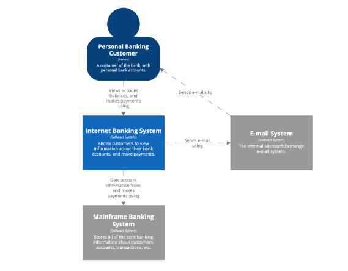
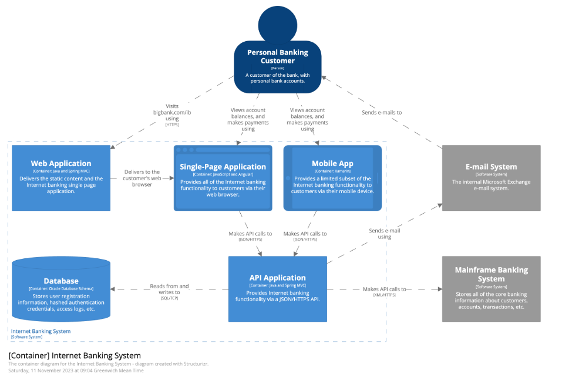
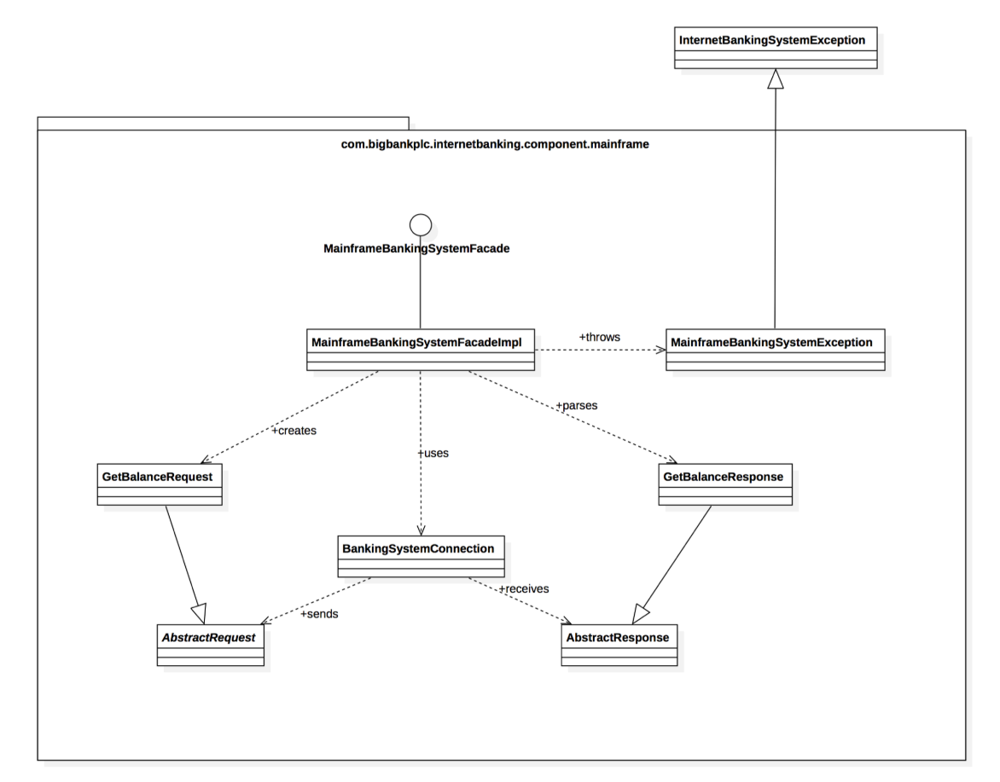

# C4 Model
É um modelo para representar arquitetura de maneira gráfica através de diagramas.
https://c4model.com/

## Propósito
Algo que acontece na comunidade é cada um representando arquitetura de uma maneira diferente.
Esse modelo tem o objetivo de padronizar um pouco, oferenco um modelo fácil de ser entendido, assim talvez incentivando arquitetos a documentarem de maneira mais padronizada por estarem usado o mesmo modelo.

## Níveis
A ideia dela é poder representar a arquitetura em 4 níveis diferentes, do mais alto para o mais baixo nível, podendo até chegar a nível de código.

Os níveis sao: context, container, component e code.

## Context
Nesse nível, nós temos uma visão completa da aplicação mas de alto nível, onde enxergamos por exemplo os serviços que compõe esse sistema. Também visualizamos os "atores", que são os usuários que interagem com o sistema.

## Container
Nesse nível, é como se pegássemos o sistema do nível anterior e vemos todos os componentes, que podem ser coisas como: web app, banco de dados, single page app, mobile app etc.

Esse normalmente é o nível mais útil.

## Components
Aqui é onde entramos no detalhe dos containers. Por exemplo, no nível anterior tínhamos um "web app". Ao entrar no nível "component" desse componente, veremos coisas como: "sign in controller", "reset pass controller", "email service" etc.

## Code
Aqui é o tipo menos usado pois ele entra muito no detalhe. A ideia é mostrar os componentes de código mesmo, como classes, interfaces etc.

