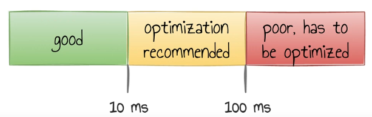

- temos 2 tipos de "gargalos" numa aplicacao: I/O bound e CPU bound.
- quando o maior gargalo da aplicacao é I/O em vez de CPU, não vale muito a pena estratégias como "mudar a linguagem de programação" pra tunar a aplicação.
- quando I/O é o gargalo, vale apena tentarmos otimizar a comunicação com banco de dados, escritas em disco etc.
- No caso de sistemas distribuídos, normalmente o gargalo é I/O.

transaction time de uma requisicao no banco de dados é composto por:
 - tempo pra adquirir a conexão +
 - tempo pra requisicao ser enviada ao banco +
 - tempo de execucao do comando + 
 - tempo de resposta do banco pro consumer +
 - tempo em que a transação fica "idle", que acontece enquanto a aplicacao processa a resposta do banco

 -> quanto menor esse transaction response time, maior o throughput.


## Melhorando o tempo de conexão com o banco
estratégias de criaçao de conexao com banco de dados:
 - é uma má ideia abrir uma conexao para cada requisicao que nossa aplicacao recebe
 - pois provavelmente, o número de requisições simultaneas pode ser maior que o número de conexões que o banco suporta
 - portanto, é legal que a gente tenha um componente no nível da aplicação que gerencia essas requisições, isso normlamente é chamado de connection pool. Isso traz vantagens:
    - compartilha uma conexão pra várias requisições
    - as conexões já podem estar previamente abertas, assim diminuindo o transaction time de acesso ao banco pois não será necessário abrir uma conexão
    - caso o número de conexões compartilhadas não seja o suficiente em algum momento, esse gerenciador pode criar mais
    - caso a demanda diminua, o gerenciador pode fechar conexões abertas que são desnecessárias

sobre connection pool:
 -  se vc tem problemas de performance com o banco, muito provavelmente vc nao vai resolver aumentar o número de conexões no pool. A causa mais provável provavelmente algo nada eficiente que está sendo feito. Como regra de ouro, diminua ou mantenha o pool com o mesmo número de conexões.

HikariCP é o pool mais famoso no mundo java atualmente. Ele é muito performático, sem abrir mão de segurança por race condition. No artigo https://github.com/brettwooldridge/HikariCP/wiki/About-Pool-Sizing, tem um vídeo interessante mostrando uma aplicacao com 10k usuários simultaneos, em que foi diminuido o tempo de resposta do banco de 100ms pra 2ms, ao mesmo tempo que foi dimunuído de 2000 pra 100 o número de conexões no pool. Isso mostra que além de o número de conexoes não ser o problema, normalmente um número menor pode na verdade trazer mais perfomance.

Um número menor de conexões no pool pode melhorar a performance pois, quanto mais conexões abertas mais colocamos carga no banco, fazendo com que ele tenha várias threads concorrendo, gerando fila e aumentando o número de espera, aumentando a latência. Quando diminuimos o número de conexões, nós tiramos a carga do banco e colocamos na camada de aplicação, assim, o pool de conexões trabalha protegendo o banco.

Um bom framework de pensamento, é pensar que o banco de dados precisa ser cuidado, tirando dele quando possível qualquer carga pois sua performance é mais limitada, então o ideal é jogarmos essa carga onde temos mais performance, que normalmente será na aplicação.

## Melhorando o tempo de requisição
Requisição: envio do comando para o banco de dados
No mundo java, o hibernate começa a atuar nesse ponto, dando algumas ferramentas como configuração de tamanho do batch.

### Batch size
Se temos 1000 inserções (ou qualquer outro comando) pra fazer num banco, podemos fazer isso 1 por 1, gernado assim 1000 requisições. Cada requisição dessa, tem o tempo de chegar até o banco, ser processada, e ser respondida. Isso conta como um round trip. 

Existe uma maneira de otimizar esse tempo, fazendo com que tenhamos apenas um envio e uma resposta, que é agrupando todos os comandos em um "batch". Assim o comando é enviado apenas uma vez, e respondido apenas uma vez. Em resumo, diminuímos o número de round trips de 1000 pra 1 (seguindo o exemplo de 1000 inserções).

## Melhorando o tempo da resposta
Pra melhorar o tempo de resposta, devemos fazer as consultas de maneira ajustada para cada contexto, usando o "fetch type" (termo no hibernate) correto ou trabalhando com consultas planejadas.

### Problemas n + 1
Quando lidamos com entidades 1 - n (possuem atributos que são uma lista de outras entidades), podemos cair no problema n + 1.
Esse problema é quando por exemplo, primeiro carregamos uma entidade pai, e depois, temos uma lista de entidades filhas, e pra cada uma delas, fazemos uma nova consulta.

Ex: Notas fiscais
 - 1. SELECT pra encontrar a nota pelo ID
 - 2. SELECT pra cada item da nota.

Nesse caso, se a nota tem 100 itens, teremos 101 consultas no banco. Esse é o problema n + 1.
Esse problema é o mais custoso quando falamos de bancos de dados. Esse problema não é restrito a bancos de dados, mas na verdade é um conceito mais amplo que podemos sempre que precisamos executar uma query pra uma entidade pai e uma pra cada uma de suas filhas. Então isso pode ser usado também pra consultas em api externas, leituras em disco etc.

#### Solução: Eager
Uma maneira de resolver esse problema, é configurando o ORM pra carregar a entidade no modo Eager (o padrão seria o lazy). Nesse modo, o orm ao carregar a entidade pai, vai carregar unsando um SELECT que já carrega também os filhos com um join, assim teremos todos os prontos em uma única consulta.

Obs: no hibernato, isso é chamado de `fetch type`.

##### Cuidados
Para que o modo eager se justificado, é necessário nos perguntarmos: Sempre que a entidade pai é carregada, realmente precisamos carregar todos os filhos?

Caso não, o eager pode ser acabar causando mais problemas. Pra esse caso, devemos usar uma consulta planejada.

#### Solução: Consulta planejada
A ideia é escrevermos nosso próprio SQL, fazendo apenas os joins que realmente precisamos, assim não carregamos dados desnessários.

No caso do hibernate, podemos usar o JPQL, que é um SQL mais alto nível, e podemos usar a keyword `fetch` para indicar que os mapeamentos devem ser carregados de maneira eager.

```java
entityManager
    .createQuery(
        "SELECT n FROM NotaFiscal n
        LEFT JOIN **fetch** n itens")
    .getResultList();
```
 Isso dá um pouco mais de trabalho, mas se queremos alta performance, é um trabalho que devemos fazer.

#### Solução: Projection (apenas colunas necessárias)
Uma outra maneira de otimizar, que é um complemento às outras soluções, é não trazer colunas desnecessárias. Isso ajuda a:
 - consumir menos memória (pois menos dados são pegos)
 - consulta ser mais rápida
 - diminui o trafego na rede

No hibernate, o conceito de `Projection` é justamente pra isso. Podemos usar isso em conjunto de DTOs, fazendo com que a consulta fique bastante fácil.

Por exemplo, no caso da nota fiscal, se queremos pegar itens apenas para "Devolução", e nesse caso de uso específico precisamos apenas dos campos "número" e "série", poderíamos ter uma consulta assim:

```java
List<Devolucao> notas = entityManager.
    createQuery(
        "SELECT new Devolucao(n.numero, n.serie)
        FROM NotaFiscal n
        WHERE n.tipo = 'DEVOLUCAO'"
    ).getResultList();
```

#### Solução: Paginação
Uma outra estratégia, que é complementar às outras, e essa muito fácil de entender pois sua implementação espalha seus detalhes até mesmo numa api rest, é o uso de paginação.
Essa consiste em, em vez de pegar todos os dados de uma vez, na verdade pegamos ele por partes.
Quando a consulta é para alimentar uma interface gráfica, essa estratégia acaba sendo muito natural pois pode ser meio que impossível pro usuário ver todos os dados de qualquer forma, então a paginação acaba sendo até uma estratégia de UX também.

No hibernate, podemos fazer a paginação usando o `setMaxResult` pra limitar a quantidade de registros que a consulta deve trazer. Se estamos escrevendo o SQL, usamos a keyword `LIMIT`.

```java
List<Devolucao> notas = entityManager.
    createQuery(
        "SELECT new Devolucao(n.numero, n.serie)
        FROM NotaFiscal n
        WHERE n.tipo = 'DEVOLUCAO'"
    )
    .setMaxResult(10)
    .getResultList();
```

>Quanto menor a quantidade de dados recuperados, menor o tempo de resposta, menor o consumo de memória e menor o tráfego na rede.

## Melhorando o tempo de execução
Tempo para execução de uma query/comando.

t < 10ms: bom tempo
10ms < t < 100ms: não está ruim, mas dá pra melhorar
100ms < t: está ruim. mal otimizado



https://postgres.ai/blog/20210909-what-is-a-slow-sql-query

### Domine o banco de dados que está usando
Uma premissa pra extrair o melhor do banco, é conhecer a fundo ele. Então, se estamos lidando um mysql por exemplo, devemos dominar ele pra extrair o melhor que ele pode.

### Otimizando queries SQL
#### EXPLAIN
É uma palavra chave que, quando colocada na query, faz com que o banco retorne o passo a passo da query e também o tempo de execução de cada uma.

Isso permite que a gente depure uma query, identificando mais fácil onde pode estar um gargalo.

```sql
EXPLAIN (ANALYZE, BUFFERS)
SELECT u.*
 FROM users u
WHERE
 lower(email) = 'email@example.com'
```

No retorno, podemos por exemplo ter um "seq scan". Isso significa que é uma leitura feita linha a linha, o que dependendo da tabela, pode não ser nada performático e sugere uma otimização de índices por exemplo.

No retorno, também temos o indicativo do passo que gerou aquele tempo. Por exemplo, um "Filter" seria uma clausula WHERE que colocamos. Assim já temos uma noção de onde está o problema e podemos nos concentrar em otimizar essa parte específica.

#### USE THE INDEX, LUKE
Nesse site temos boas dicas de otimizar queries em vários bancos de dados diferentes, como oracle, mysql, postgre etc.

https://use-the-index-luke.com/


continuar em 46:09
