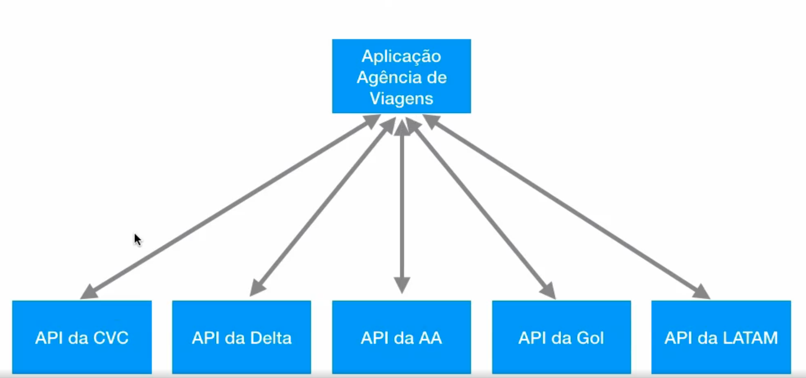

# Introdução
## Por que desenvolver REST APIs?
### API
Application programming interface
É um conjunto de funções que intermediam o acesso de um client à algo.
Ex:
 - APIs REST: expõe funções de uma aplicacao para o mundo web
 - APIs do java: as de collection por exemplo
 - API de prefeitura: podem ter uma API pra emissão de nota fiscal por exemplo
 - API do spotify/youtube etc: APIs http (algumas rest, outras graphql), que permitem que terceiros interajam com esses sistemas pra pegar dados ou outras coisas do tipo.

### Web services vs APIs
Todo webservice é o tipo de API que funcionam via web.
Todo webservice é uma API, mas nem toda API é um webservice. Por exemplo, APIs do java não são webservices.

### Exemplo de uso de web services
Aplicação de agencia de viagens

Nesse exemplo, veja que conseguimos criar um agregador de várias companias usando as APIs delas.