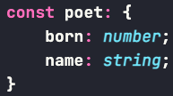

# Objetos
## Tipos objeto
Quando criamos uma variável com a sintaxe `{...}`, o typescript vai entender que estamos usando um novo tipo de objeto.
Dentro das chaves, podemos passar as chaves e os valores, e para acessar esses valores posteriormente podemos usar um `.` ou `[]`, por exemplo `value.member` ou `value['member']`.
Nesse tipo de objeto, o typescript vai acusar um erro caso a gente tente acessar uma propriedade que não foi declarada ao definir o objeto.

```typescript
const poet = {
  born: 1935,
  name: "Mary Oliver",
}

console.log(poet['born']) //Vai imprimir 1935
console.log(poet.name) //Vai imprimir Mary Oliver
console.log(poet.end) //Typescript dá erro dizendo que a propriedade não existe
```

Interessante perceber qual o tipo de `poet`. Se passarmos com o cursor por `poet`, vamos ver que o tipo é bem extenso (exemplo abaixo). Ou seja, o tipo é literalmente o que a gente definiu ao declarar a variável.



### Declaração de tipos de objeto
No exemplo anterior, o tipo da variável foi inferido pelo valor que nós passamos. Mas e quando queremos criar o tipo para usá-lo posteriormente? A sintaxe é bem parecida.

Ex:
```typescript
//Declarando o tipo para só depois passar um valor
let newPoet: {
  born: number;
  name: string;
}

newPoet = {
  born: 1935,
  name: "Mary Oliver"
}
```

### Apelidos (aliases) de tipos
O typescript nos dá uma forma de criar aliases para nossos tipos customizados. Para isso, temos duas palavras chaves, `type` e `interface`. O mais comum é usar `interface`, porém, nesse estágio mais inicial do livro, vamos ficar com o `type` mesmo pois `interface` vai ser abordado no capítulo 7.
Obs: `type` e `interface` tem o funcionamento quase identico.

Ex:
```typescript
//Alias de tipo
type Poet = {
  born: number;
  name: string;
}

let poetWithType: Poet;
poetWithType = {
  born: 1935,
  name: "Sara Teasdale",
  newField: "teste", //Erro pois essa propriedade não existe no tipo que criamos
}
```


